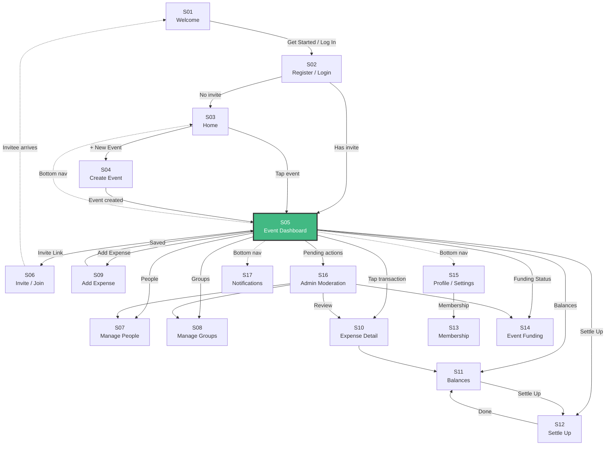

# Interactive Navigation Map

Click any screen to jump to its specification.

**S05 Event Dashboard** (highlighted in green) is the central hub. All journey rails pass through it.

## Journey Rails

| Rail | Path | Description |
|------|------|-------------|
| [R01 Onboarding](/rails/R01-onboarding-rail.md) | S01 → S02 → S03 → S04 → S05 | New user signs up and creates first event |
| [R02 Expense](/rails/R02-expense-rail.md) | S05 → S09 → S05 → S10 → S11 | Add an expense and view balances |
| [R03 Settlement](/rails/R03-settlement-rail.md) | S11 → S12 → S11 → S05 | Settle debts between participants |
| [R04 Invitation](/rails/R04-invitation-rail.md) | S05 → S06 ··· S01 → S02 → S05 | Send invite, invitee joins event |
| [R05 Membership](/rails/R05-membership-rail.md) | S15 → S13 → S05 → S14 | Manage subscription and event funding |
| [R06 Admin](/rails/R06-admin-rail.md) | S05 → S16 → S07/S08/S10/S14 | Review and moderate pending actions |
